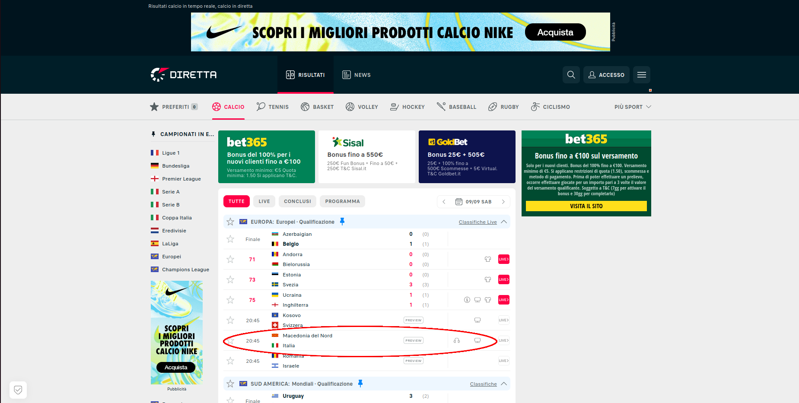
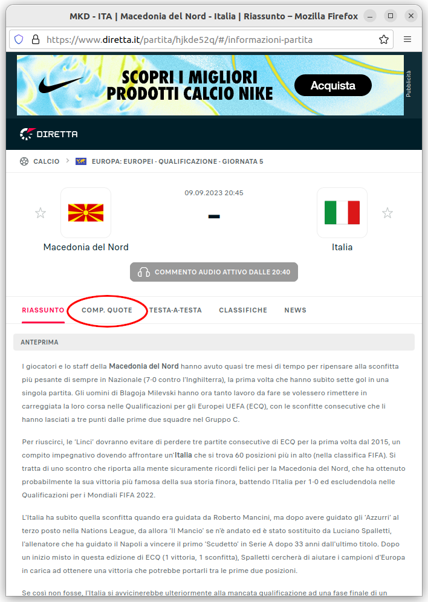
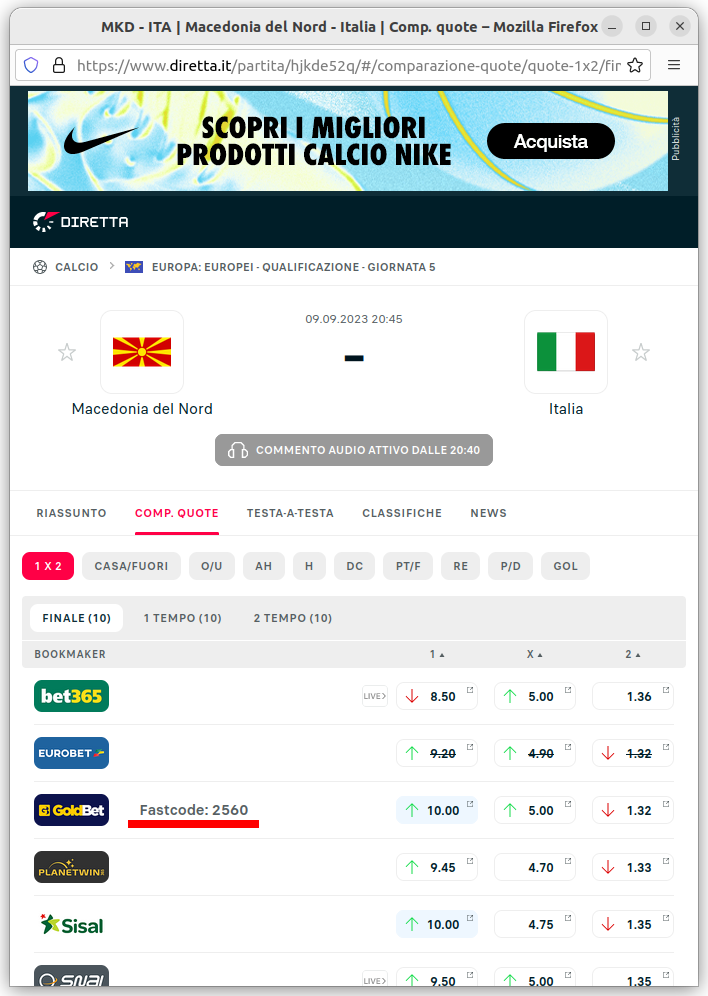

# DirettaGold

DirettaGold is a Firefox WebExtension that shows the GoldBet fastcode for any match on diretta.it.

# Installation

## Firefox

You can get the latest version of DirettaGod from the [Mozilla Add-ons website](https://addons.mozilla.org/en-US/firefox/addon/direttagold/).

# Screenshots

To use DirettaGold, follow these steps:
1. Visit www.diretta.it and click on a match of your choice.  
2. In the match details window, click the “COMP.QUOTE” tab.  
3. You will see the fastcode next to the GoldBet logo on the right.  
